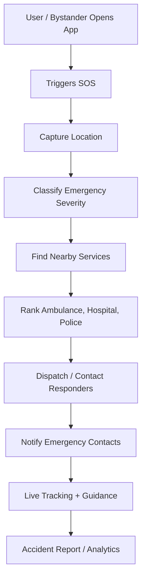

# RoadSOS

**AI-Powered Location-Based Emergency Road Assistance Platform**

RoadSOS is a mobile-first emergency response prototype built for the **IIT Madras CoERS Road Safety Hackathon 2026**. It is designed to help accident victims and bystanders quickly connect with nearby hospitals, ambulances, police stations, emergency contacts, and roadside assistance services through a single, fast, panic-friendly interface.

> **Tagline:** Connecting accident victims to the nearest medical, police, ambulance, and roadside assistance services within seconds.

---

## 🚨 Problem Statement

During a road accident, victims and bystanders often lose critical time because emergency information is fragmented across apps, search engines, phone contacts, maps, and helplines. In low-network areas, this problem becomes worse because many app-based solutions stop working exactly when they are needed most.

RoadSOS addresses these major gaps:

- Difficulty finding nearby hospitals, ambulances, police, and towing services under pressure
- Delayed family notification after an accident
- Lack of structured first-aid guidance for bystanders
- Poor emergency support in low-network or offline locations
- No unified platform for alerting, guidance, live tracking, and documentation

---

## ✅ Proposed Solution

RoadSOS acts as a **digital emergency co-pilot**. With one SOS trigger, the app simulates an emergency workflow that captures location, ranks nearby responders, dispatches relevant services, notifies family, provides live tracking, and shows emergency impact analytics.

The current repository contains a **Next.js frontend prototype** with a mobile-app-style interface that demonstrates the core emergency response experience.

---

## ✨ Key Features

### Current Prototype

- **One-Tap SOS Trigger**  
  Starts the emergency response workflow from a large, accessible SOS button.

- **Voice-First Emergency Flow**  
  Simulates voice-based emergency input such as accident reporting and ambulance requests.

- **Emergency Processing Pipeline**  
  Shows step-by-step progress for location capture, emergency contact alerts, responder ranking, and dispatch.

- **Live Tracking Screen**  
  Displays ambulance ETA, distance, responder status, police dispatch, and emergency timeline.

- **Dispatch Panel**  
  Lists nearby emergency responders such as ambulances, police, and hospitals with dispatch actions.

- **Hospital / Responder Dashboard**  
  Shows incoming emergency cases, severity indicators, and active treatment status.

- **Impact Analytics**  
  Visualizes response time, road safety impact, and comparison with existing emergency systems.

- **Dark Mobile UI**  
  Built with a clean emergency-grade dark theme suitable for stressful situations and low-light usage.

### Planned / Full Product Features

- AI emergency first-aid chatbot
- Verified emergency service database
- Offline emergency mode
- SMS-based SOS fallback
- Live location sharing with family and responders
- Multilingual support: English, Hindi, Marathi
- Accident report generator
- Bystander mode
- Safe-zone and accident blackspot alerts
- Hospital bed and ambulance availability integration

---

## 🧠 How RoadSOS Works



---

## 🏗️ System Architecture

RoadSOS is planned as a modular emergency response system:

```text
User Interface Layer
        ↓
API Gateway
        ↓
Core Services
 ├── User Module
 ├── Location Module
 ├── Emergency Service Module
 ├── SOS Alert Module
 ├── AI Guidance Module
 ├── Offline Module
 ├── Accident Report Module
 └── Admin / Verification Module
        ↓
External Integrations
 ├── Maps / Geolocation API
 ├── SMS Gateway
 ├── WhatsApp API
 ├── Push Notifications
 └── AI / NLP Engine
```

---

## 🛠️ Tech Stack

### Current Repository

| Layer | Technology |
|---|---|
| Framework | Next.js |
| Language | TypeScript |
| UI | React |
| Styling | Tailwind CSS |
| Components | shadcn/ui, Radix UI |
| Icons | lucide-react |
| Charts | Recharts |
| Package Manager | pnpm |

### Planned Full-Scale Product

| Layer | Suggested Technology |
|---|---|
| Mobile App | React Native / Flutter |
| Backend | Node.js + Express.js or FastAPI |
| Database | PostgreSQL / MongoDB |
| Offline Storage | IndexedDB / SQLite / Local Storage |
| Authentication | JWT / OAuth 2.0 |
| Maps | Google Maps API / Mapbox / OpenStreetMap |
| Alerts | Twilio / Fast2SMS / Firebase Cloud Messaging |
| AI Layer | Gemini / OpenAI / Rule-Based Emergency Classifier |
| Reports | PDFKit / ReportLab |
| Deployment | Vercel, Railway, AWS, or GCP |

---

## 📁 Project Structure

```text
.
├── app/
│   ├── globals.css
│   ├── layout.tsx
│   └── page.tsx
├── components/
│   ├── roadsos/
│   │   ├── screens/
│   │   │   ├── analytics-screen.tsx
│   │   │   ├── dashboard-screen.tsx
│   │   │   ├── dispatch-screen.tsx
│   │   │   ├── home-screen.tsx
│   │   │   └── tracking-screen.tsx
│   │   ├── map-view.tsx
│   │   ├── nav-bar.tsx
│   │   ├── pipeline-steps.tsx
│   │   ├── responder-card.tsx
│   │   ├── sos-button.tsx
│   │   ├── stat-card.tsx
│   │   └── voice-wave.tsx
│   └── ui/
├── hooks/
├── lib/
├── public/
├── styles/
├── package.json
├── pnpm-lock.yaml
└── tsconfig.json
```

---

## 🚀 Getting Started

### Prerequisites

Install the following before running the project:

- Node.js 18 or above
- pnpm

Install pnpm globally if it is not already installed:

```bash
npm install -g pnpm
```

### Installation

Clone the repository:

```bash
git clone https://github.com/samrudhimadankar/RoadRakshak.git
cd RoadRakshak
```

Install dependencies:

```bash
pnpm install
```

Run the development server:

```bash
pnpm dev
```

Open the app in your browser:

```text
http://localhost:3000
```

---

## 📜 Available Scripts

```bash
pnpm dev
```

Runs the app in development mode.

```bash
pnpm build
```

Builds the app for production.

```bash
pnpm start
```

Starts the production server after building.

```bash
pnpm lint
```

Runs lint checks.

---

## 🖥️ Main Screens

| Screen | Purpose |
|---|---|
| SOS Home | Trigger emergency workflow and voice-first SOS processing |
| Dispatch | View and dispatch nearby responders |
| Live Tracking | Track ambulance ETA, police status, and incident timeline |
| Dashboard | Hospital / responder-side emergency overview |
| Impact | Show analytics, response time comparison, and social impact |

---

## 🎯 MVP Scope

The hackathon MVP focuses on demonstrating the complete emergency response journey:

1. User triggers SOS
2. Location is captured
3. Nearby responders are identified
4. Emergency contacts are notified
5. Ambulance / police / hospital services are dispatched
6. User sees live tracking and ETA
7. Dashboard displays incoming cases
8. Impact analytics show expected real-world benefit

---

## 🔮 Future Scope

- Real GPS and reverse geocoding integration
- Real emergency service database
- SMS and WhatsApp alert integration
- AI-powered first-aid chatbot
- Offline-first emergency instructions
- Crash detection using phone sensors
- Ambulance live tracking
- Hospital bed availability integration
- Police control room dashboard
- Accident report PDF generation
- Community responder network
- Country-wise emergency number database

---

## 👥 Team

**Team CodeX**

- Samrudhi Madankar
- Esha Ghosh
- Rudra Kathoke

Built for **IIT Madras CoERS Road Safety Hackathon 2026**.

---

## 📌 Project Status

This repository currently contains a frontend prototype. Backend services, real-time emergency integrations, authentication, database connectivity, SMS/WhatsApp dispatch, and production-grade AI guidance are part of the planned full implementation.

---

## ⚠️ Disclaimer

RoadSOS is a hackathon prototype and is not currently a certified emergency response system. In real emergencies, users should contact official emergency helplines such as **112**, **108**, **102**, **101**, or the nearest available local emergency service.

---

## 📄 License

This project is currently intended for hackathon and educational use. Add a license file before public production release.
